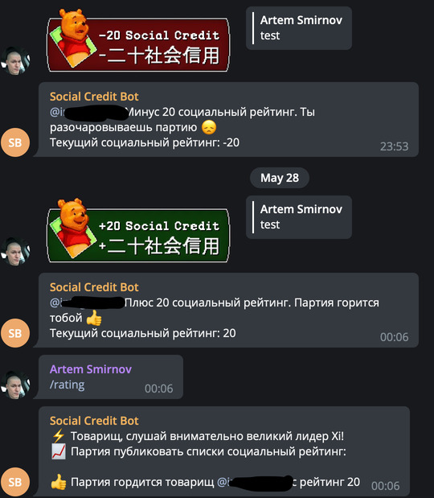

# Social Credit Bot


Simple Social credit bot for Telegram written in Kotlin.



## Building

```shell
./gradlew clean build jar
```

## Running

### Locally

You'll need only JRE (at least 13).

Create file named `secret.properties` with the following contents:

```properties
bot_token=token-from-botfather
```

```shell
java -jar build/libs/SocialCreditBot-<version>.jar secret.properties local.db
```

### With Docker

Create directory named `data`, place `secret.properties` (see above) there.

Create `docker-compose.yml` with the following contents:

```yaml
version: '3.8'

services:
  app:
    image: rankor777/social-credit-bot:x.y.z
    volumes:
      - ./data:/data/
    restart: always
```

_Replace `x.y.z` with an actual version_

Now run `docker-compose up -d`.

## Usage

Add bot in group, then reply on some message with one of [these](https://t.me/addstickers/PoohSocialCredit) two stickers.

Bot also supports two commands:

- `/rating` — prints 50 random users (TODO: Add ordering) ratings
- `/my_rating` — prints your rating

Enjoy!

```
                    .--,
     .-.    __,,,__/    |
    /   \-'`        `-./_
    |    |               `)
     \   `             `\ ;
    /       ,        ,    |
    |      /         : O /_
    |          O  .--;__   '.
    |                (  )`.  |
    \                 `-` /  |
     \          ,_  _.-./`  /
      \          \``-.(    /
      |           `---'   /--.
    ,--\___..__        _.'   /--.
    \          `-._  _`/    '    '.
    .' ` ' .       ``    '        .
```

## Dependencies

- [kotlin-telegram-bot](https://github.com/kotlin-telegram-bot/kotlin-telegram-bot)
- [Exposed](https://github.com/JetBrains/Exposed)
- [sqlite-jdbc](https://github.com/xerial/sqlite-jdbc)

## TODO

- Sort `/rating` descending on the DB level
- Make `/rating` print only current group members
- Add the «Rice Plate» & «Cat Wife» rewards

## License

```
Copyright 2021 Artem Smirnov

   Licensed under the Apache License, Version 2.0 (the "License");
   you may not use this file except in compliance with the License.
   You may obtain a copy of the License at

       https://www.apache.org/licenses/LICENSE-2.0

   Unless required by applicable law or agreed to in writing, software
   distributed under the License is distributed on an "AS IS" BASIS,
   WITHOUT WARRANTIES OR CONDITIONS OF ANY KIND, either express or implied.
   See the License for the specific language governing permissions and
   limitations under the License.
```